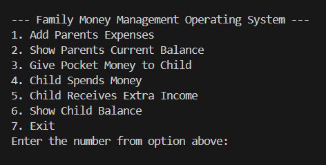

# Family Money Management System - A Money Manager of Family

This is a Python console-based project that simulates a family money management system.
It helps manage a parent's salary, expenses, pocket money of child, and a child's spending.

The project is designed using Object-Oriented Programming (OOP) concepts.

-----

## Features:-
- Add and track parent's expenses.
- Show parent's total salary and remaining balance.
- Give pocket money to the child.
- Track child's pocket money, spending, and extra income.
- Menu-driven interactive system.
- Proper input validation to prevent invalid entries.

-----

## OOP Concepts that have used:-
- Class and Object.
- Inheritance.
- Encapsulation.
- Method Overriding.
- Use of `super()` keyword.
- Dictionary for storing expense records.

-----

## Class Structure:-

### Person Class
- Base class that stores name and role.
- Used by both Parent and Child classes.

### Parent Class (Inherits Person)
- Stores salary and expense details.
- Adds expenses with category and amount.
- Gives pocket money to the child.
- Displays expense history and remaining balance.

### Child Class (Inherits Person)
- Receives pocket money and extra income.
- Spends pocket money.
- Displays pocket money summary.

-----

## Menu Options:-
1. Add Parent's Expenses:  
2. Show Parent's Current Balance:    
3. Give Pocket Money to Child:   
4. Child Spends Money:  
5. Child Receives Extra Income:  
6. Show Child's Current Balance:  
7. Exit  

  

-----

## Input Validation:
- Expense category cannot be empty or contain numbers.
- Amount must be greater than zero.
- Parent cannot spend more than available salary.
- Child cannot spend more than available pocket money.
- Handles invalid numeric inputs using `try-except`.

-----

## How to Run the Project
1. Install Python 3.
2. Save the code in a `.py` file.
3. Run the file using the command:

## Made by: 
Md. Arham Ishtiyaque